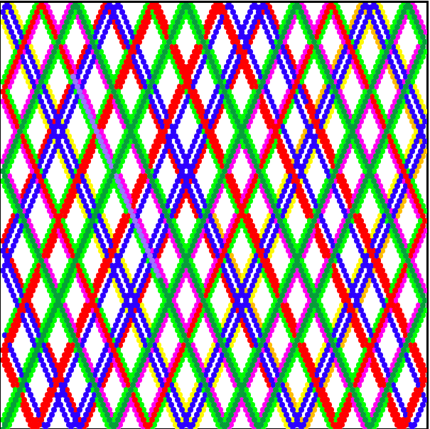
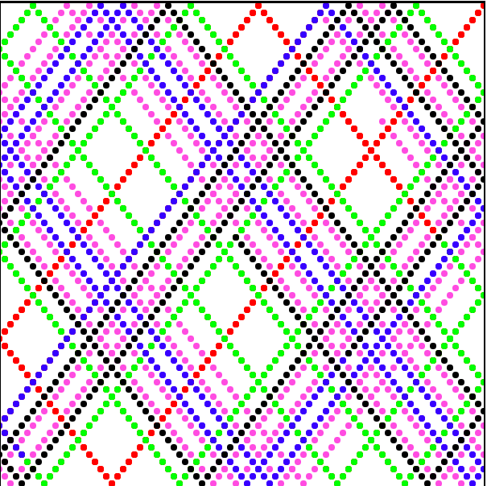

# Pattern Creator 

How to use
------------------

It's pure Javascript, HTML and CSS. All you have to do is open index.html.

Before you use, give a value to _VelocityX_ and _VelocityY_.

After, just click "Run" button to start drawing.

When process is going, you can stop it by "Pause" button or you can clear the canvas by "Clear".

Also you can change values of _Process Speed_, _BallX_, _BallY_ and _Color_.

**BallX and BallY**: It's values of the coordinates of our ball.

**Ball Radius**: It changes radius of our ball.

**Process Speed**: It effects the speed of our ball.

**Color**: It changes color of the ball (Helps for better and sightly results.). 

Screenshots
------------------

